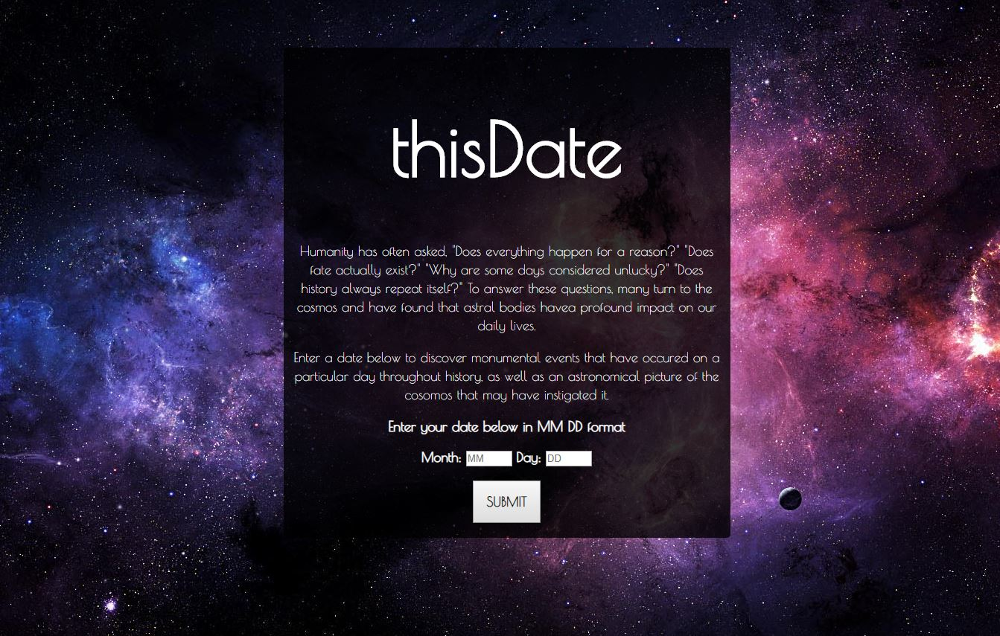

                

                <h3 class ="grid-title">PROJECTS</h3>
                
<b>thisDate</b> - An application which renders a list of events that occurred on a particular day in history, as well as generates an image of the sky on that day.

                
Skills Used: HTML, CSS, JavaScript, jQuery, & RESTful APIs

                <a href="https://michaelargent.github.io/thisDate-Application/">Link to thisDate</a>
                <a href="https://github.com/michaelargent/thisDate-Application">Link to the code behind thisDate</a>
                

